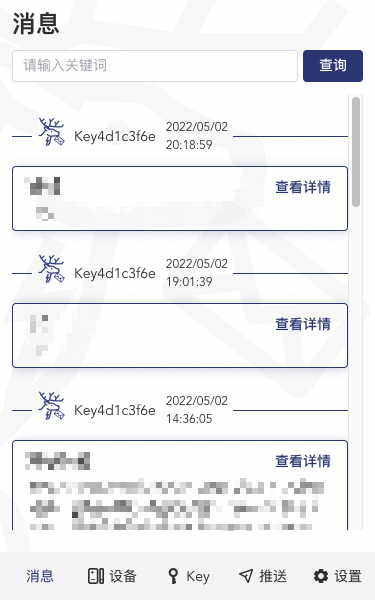

# pushdeer-crx
pushdeer client for edge and chrome

### How to use

1. Download the [releases](https://github.com/xkrfer/pushdeer-crx/releases)

2. Decomporess the pushdeer-crx.zip

3. Open the extensions management,like chrome://extensions or edge://extensions

4. Enable Developer mode

5. Load uppacked the pushdeer-crx

6. Build the [pushdeer-node](https://github.com/xkrfer/pushdeer-node)  and enjoy it

### 如何使用

1. 下载最新的 [releases](https://github.com/xkrfer/pushdeer-crx/releases) 包

2. 解压 **pushdeer-crx.zip**

3. 打开浏览器的插件管理，chrome://extensions 或 edge://extensions

4. 打开**开发者模式**

5. 点击 **加载解压缩的扩展**，选择刚刚解压的文件夹 **pushdeer-crx**

6. 需配合 [pushdeer-node](https://github.com/xkrfer/pushdeer-node) 使用

### FAQ

提示设备不存在
 
1. 检查是否已注册设备 
2. 完全退出再打开浏览器，再点击插件 
3. 如果2还不行，重新加载插件 
4. 由于本插件使用 @fingerprintjs/fingerprintjs 生成设备码，所以可能会出现上述情况，欢迎大家提供更好的方案
 

### Screenshot

